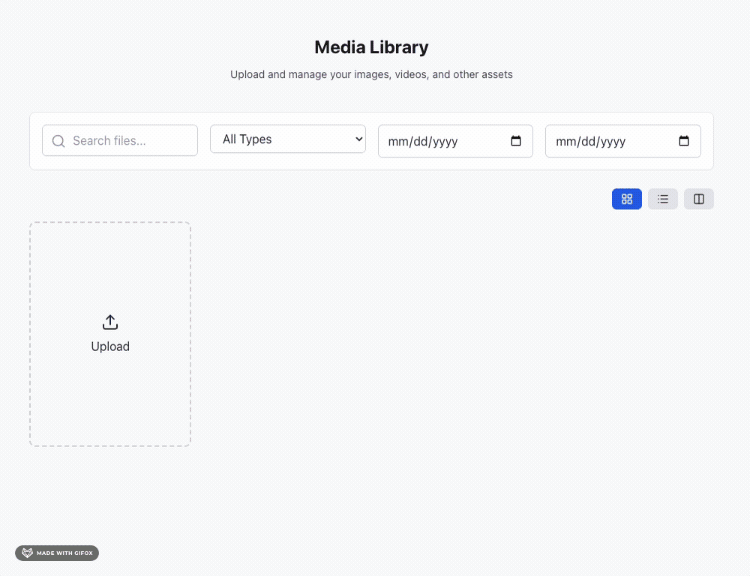

# @reactkits.dev/react-media-library

A headless UI, fast media library for React 19+.


## Why This Library?

- **Headless** - Bring your own UI. Works with Tailwind, Mantine, or any component library
- **Fast** - Optimized for performance from day one. Zero layout shift, lazy loading, tree-shakeable
- **Simple** - Full media library in 10 lines of code
- **Local Storage** - No server needed. Uses IndexedDB + OPFS

## Demo



Try it live at [reactkits.dev/react-media-library](https://www.reactkits.dev/react-media-library/)

## Installation

```bash
npm install @reactkits.dev/react-media-library

# Optional: icons
npm install lucide-react
```

## Quick Start

```tsx
import {
  MediaLibraryProvider,
  MediaGrid,
  tailwindPreset,
  lucideIcons
} from '@reactkits.dev/react-media-library';

function App() {
  return (
    <MediaLibraryProvider enableDragDrop={true}>
      <MediaGrid
        preset={tailwindPreset}
        icons={lucideIcons}
      />
    </MediaLibraryProvider>
  );
}
```

That's it. Drag & drop uploads, search, filters, grid/list/masonry views - all included.

## Headless Architecture

The library doesn't ship any UI. You provide components via a `preset`:

```tsx
const myPreset = {
  Card: (props) => <div className="my-card" {...props} />,
  Button: (props) => <button className="my-btn" {...props} />,
  TextInput: ({ value, onChange }) => (
    <input value={value} onChange={e => onChange(e.target.value)} />
  ),
  // ... see types for full list
};

<MediaGrid preset={myPreset} />
```

Built-in presets: `tailwindPreset`, `mantinePreset`

## Bundle Size

| Module             | Gzipped       |
| ------------------ | ------------- |
| Core               | 17 KB         |
| Image Editor       | 4.6 KB (lazy) |
| Cropper (optional) | 15 KB (lazy)  |

## Contributing

We welcome contributions! When contributing, please ensure the demo maintains the Lighthouse scores shown in the repository.

### Setup

1. Clone the repository
2. Install dependencies:
   ```bash
   npm install
   cd demo && npm install
   ```

### Verifying Lighthouse Scores

To build and preview the demo, then verify Lighthouse scores match the repository:

1. **Build and preview the demo:**

   ```bash
   cd demo
   npm run preview
   ```

2. **Run Lighthouse audit:**

   - Open Chrome DevTools
   - Go to the Lighthouse tab
   - Select "Performance", "Accessibility", "Best Practices", and "SEO"
   - Click "Analyze page load"
   - Compare scores with the image in the repository (`demo/lighthouse-result.png`)

The build output will be in `demo/dist/`.

### Performance Guidelines

To maintain the Lighthouse scores, please follow these guidelines:

- **Code Splitting**: Keep manual chunk splitting as configured in `demo/vite.config.ts`
- **Minification**: Ensure `terser` is used with console removal enabled
- **Lazy Loading**: Image Editor and Cropper should remain lazy-loaded
- **CSS**: Keep `cssCodeSplit: false` to minimize CSS files
- **Bundle Size**: Monitor bundle sizes and avoid adding large dependencies
- **Tree Shaking**: Ensure unused code is properly tree-shaken
- **No Console Logs**: All console statements are removed in production builds

### Key Build Configuration

The demo uses specific Vite optimizations:

- Terser minification with console removal
- Manual chunk splitting for React, lucide-react, and idb
- CSS code splitting disabled
- Target: `esnext` for modern browsers

---

If you like what I'm doing, consider following me:

`<a href="https://www.linkedin.com/in/david-ang-0932bb4a/">``</a>`
`<a href="https://x.com/papayaahtries">``</a>`
`<a href="https://www.reddit.com/user/Prize-Coyote-6989/">``</a>`

## License

MIT
