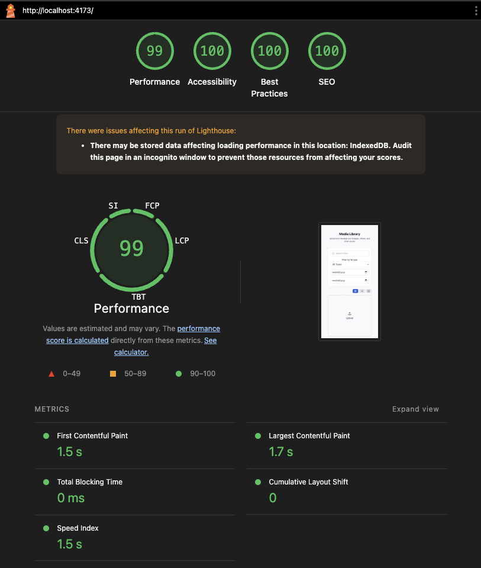

# React Media Library

A lightweight, high-performance media library for React 19 that follows all best practices to ensure maximum speed and efficiency. This library is designed to be as fast as possible while providing a complete set of media management features.



## Features

- Drag & drop support
- Real-time search by filename
- Filter by file type (images, videos, audio, documents, other)
- Date range filtering
- Select mode with bulk delete operations
- Individual file deletion
- Image viewer modal
- Responsive grid, list, and masonry layouts
- Loading and empty states
- Persistent storage using IndexedDB and OPFS
- UI-agnostic design - works with any UI library

## Smooth Upload Experience

One of the standout features of this library is the **zero-layout-shift upload experience**. When you drag and drop multiple files:

1. **Skeleton loaders appear instantly** matching the exact dimensions of your grid items
2. **Each file is processed incrementally** - as soon as one file is ready, it replaces its skeleton
3. **Images fade in smoothly** - the actual image loads behind the skeleton and fades in with a subtle opacity transition
4. **No jumping or shifting** - the layout remains perfectly stable throughout the entire upload process

This creates a buttery-smooth experience even when uploading dozens of files at once. The skeleton loaders maintain the grid structure while files are being processed, and each image seamlessly transitions into view as it becomes available.


*Demo: Drag and drop multiple files with zero layout shift*

## Installation

Install the library:

```bash
npm install @buzzer/media-library
```

**Icons are optional**: The library does NOT automatically install any icon library. You have three options:

1. **Use the Lucide React preset** (recommended for quick start):
   ```bash
   npm install lucide-react  # Must install separately
   ```

2. **Use your own icon library** - Pass your own icon components (see "Using Your Own Icons" below)

3. **No icons** - Icons are optional. If you don't provide icons, text fallbacks will be used

## Usage

### Using the Lucide Icons Preset (Recommended)

```tsx
import { MediaLibraryProvider, MediaGrid, tailwindPreset, lucideIcons } from '@buzzer/media-library';

function App() {
  return (
    <MediaLibraryProvider enableDragDrop={true}>
      <MediaGrid preset={tailwindPreset} icons={lucideIcons} />
    </MediaLibraryProvider>
  );
}
```

### Using Your Own Icons

You can use any icon library or provide your own React components:

```tsx
import { MediaLibraryProvider, MediaGrid, tailwindPreset } from '@buzzer/media-library';
import { Upload, Search, Trash2, Image, Video, Music, FileText, File } from 'your-icon-library';

const icons = {
  upload: Upload,  // Icon component (not JSX element)
  search: Search,
  trash: Trash2,
  photo: Image,
  video: Video,
  audio: Music,
  document: FileText,
  file: File,
};

function App() {
  return (
    <MediaLibraryProvider enableDragDrop={true}>
      <MediaGrid preset={tailwindPreset} icons={icons} />
    </MediaLibraryProvider>
  );
}
```

## Storybook

To launch Storybook and view live examples:

```bash
npm run storybook
```

This will start Storybook on http://localhost:6006 where you can see:

- Tailwind CSS preset examples
- Mantine UI preset examples (light and dark modes)
- How to create your own custom preset

## License

MIT
